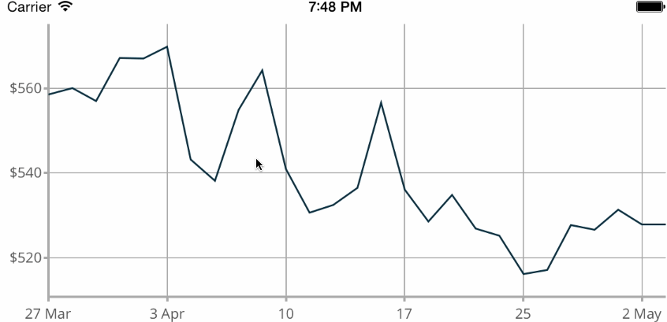
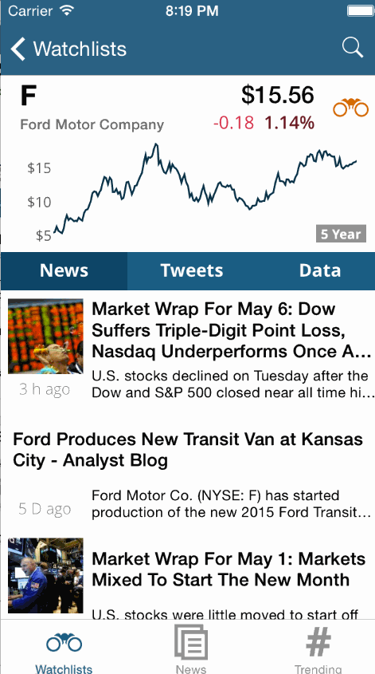

# JCStockGraph

[](http://cocoadocs.org/docsets/JCStockGraph)
[](http://cocoadocs.org/docsets/JCStockGraph)

JCStockGraph is an easy way to show historical price graphs for any security (that is listed in the Yahoo finance api). Here are some example screenshots of the graphs being used in the [Benzinga Stock Tracker](https://itunes.apple.com/us/app/benzinga-stock-news-tracker/id688949481?mt=8) app:

</img>

</img>

## Features

- Graphs with 5 different time ranges for any security in the Yahoo finance api.
- Page-able scroll views containing a graph for each different range.
- Several options to customize the aesthetics of the graphs.
- Dragging to pan and pinching to zoom are both supported.
- Dynamically updated axis labels, as shown in the gif above.

## Usage

For a single graph, use JCStockGraphController. For a page-able scroll view containing a graph for each time range, use JCStockGraphPageController. Just initialize the controller, set the options, and add it's view as a subview like so:

```objectivec
    self.graph = [[JCStockGraphPageController alloc] initWithTicker:@"AAPL"];
    // or self.graph = [[JCStockGraphController alloc] initWithTicker:@"AAPL"]; for just one page

    self.graph.view.frame           = CGRectMake(0, 100, 320, 100);
    self.graph.graphOffset          = CGPointMake(10, 0);
    self.graph.graphSize            = CGSizeMake(300, 100);
    self.graph.graphOptions         = kGraphOptionSmoothGraph | kGraphOptionHideXAxis | kGraphOptionHideGrid;
    self.graph.shouldAutoscroll     = YES;
    self.graph.shouldShowRotateHint = NO;

    [self.view addSubview:self.graph.view];
    // If this code all runs AFTER the superview is already loaded, add the line:
    [self.graph reloadViews];
    // This is because of an issue (listed below) with Core Plot dynamic resizing
```

Note: To enable panning and zooming with the Page controller, what I've done is disable scrolling in the page controller itself, and instead switch between graphs using a UISegmentedControl underneath the graphs. Then you just switch graphs in code using scrollToRange:(JCStockGraphRange)newRange.

Check out the example project and the headers for more info and the full list of options. To run the example project; clone the repo, and run `pod install` from the Example directory first.

## Installation

JCStockGraph is available through [CocoaPods](http://cocoapods.org), to install
it simply add the following line to your Podfile:

    pod "JCStockGraph"

It is worth noting that JCStockGraph has 5 separate dependencies, which many would consider to be a high amount for a fairly small control. At least the last two (MTDates and FontasticIcons) could easily by replaced without much effort, and MBProgressHUD & AFNetworking aren't strictly necessary either. If you do decide to replace any of them with custom code, by all means submit me a pull request!

## Known Issues

- If a stock has only been public for e.g. 3 months, then the 5-year, 1-year, and 3-month graphs will all be duplicates. There is probably a more elegant way to handle this (removing the unnecessary ranges, or maybe just always showing the full time range, even when it's mostly empty).
- More options would be nice. Particularly, setting colors in the options seems really necessary.
- Because of the way CorePlot works, graphs can't be resized dynamically, which is a problem if you want to animate the resizing. If anyone has a workaround for this, I would be delighted to hear it.

Pull requests are really appreciated, as well as opening issues for any bugs you might find.

## Author

Joseph Constantakis, jcon5294@gmail.com

## License

JCStockGraph is available under the MIT license. See the LICENSE file for more info.
